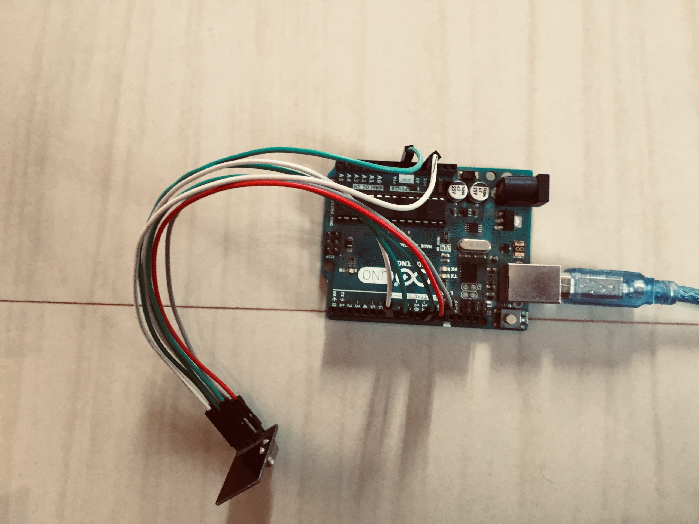

# Autonomous-Vehicle-Drive
A vehicle designed from scratch and driven autonomously using a MLP.

## File description

### Directory - /RcDriveTest

1. `rc_control_test.py` - Control the car by your keyboard and test the RC car.
2. `/arduino/rc_key_controller` - Arduino Controller using Uno and a nRF24L01+.
3. `/arduino/rc_keyboard_bot` - Bot code.

### Images 

1. The remote (Ver 1.0):- 

 

2. The bot (Ver 1.0):-

| col 1      | col 2   | 
|------------|---------| 
|   |  |

